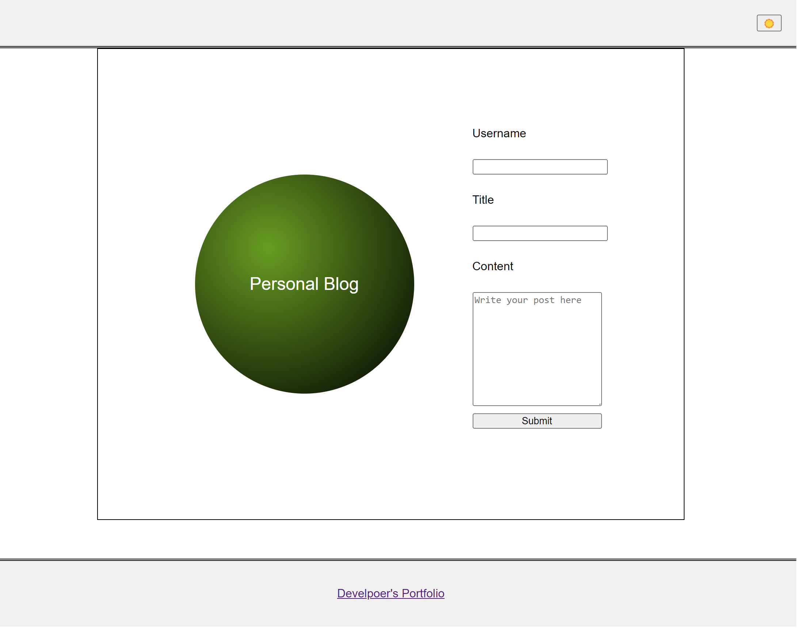
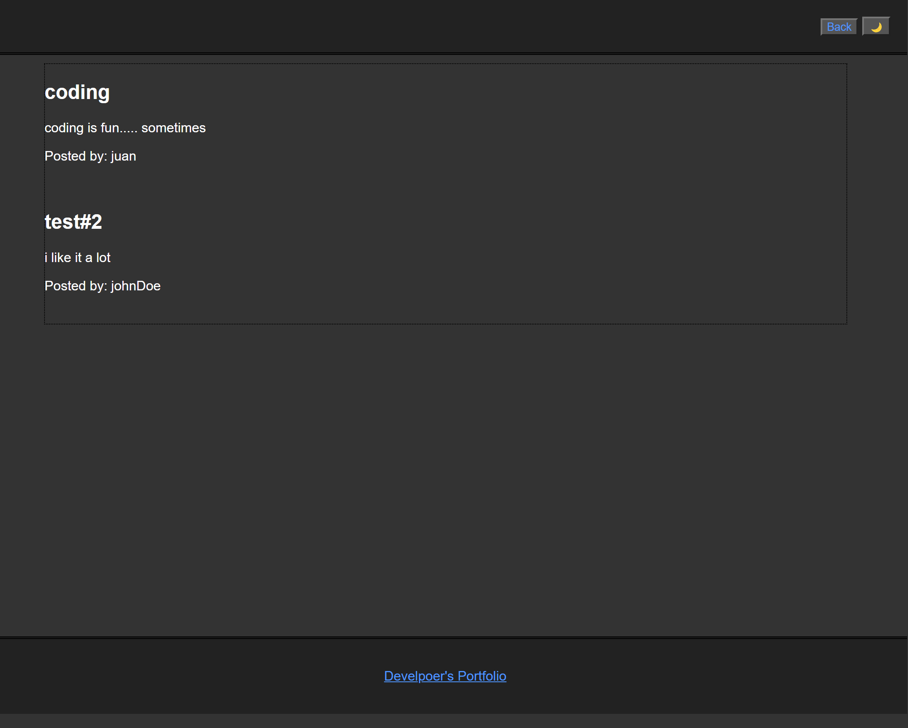

# Personal-blog

##Overview

This personal blog project is designed to allow marketing students and enthusiasts to showcase their thoughts and experiences. It features a simple yet functional web application where users can write, submit, and view blog posts.

## Features

Blog Submission Form: Users can submit blog posts using a form that captures the username, title, and content.
Local Storage: Submitted posts are stored in the browser's localStorage, enabling data persistence across sessions.
Dynamic Content Rendering: The application dynamically retrieves and displays posts from localStorage.
Light/Dark Mode Toggle: Users can switch between light and dark themes for comfortable reading under any lighting condition.
Navigation: A "Back" button allows users to navigate back to the submission form from the posts page.

## How to Use
Submit a Post: Fill in the form on the landing page with your username, post title, and content, then click "Submit".
View Posts: After submission, you're redirected to the posts page where all submissions are listed.
Toggle Theme: Use the light/dark mode toggle at the top of the posts page to switch themes.
Navigate Back: Click the "Back" button on the posts page to return to the submission form.

## Sources:

https://chat.openai.com/
https://bootcampspot.instructure.com/courses/5271/external_tools/313
https://www.w3schools.com/
https://dev.to/crayoncode/css-day-night-switch-css-html-only-part-2-3ioc

## Contact
For questions and feedback, please contact me at rinjigelu39@gmail.com

## Screenshot

## URL for blog
https://rinjeeg.github.io/Personal-blog/
